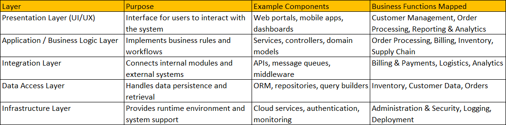
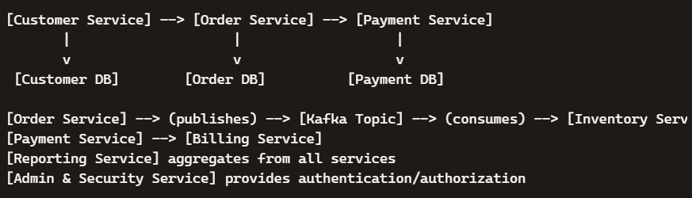

Decompose or split by Business Capability microservices:

- Decompose a system into microservices by Business Capability.
- Implement it step by step using Java 17 and Spring Boot.

🧩 Step-by-Step Program for Business Capability Microservices

1. Identify Business Capabilities
   1. Start with domain analysis: list core business functions (e.g., Customer Management, Order Processing, Inventory, Billing). For ex:
       1. Customer Management
          Purpose: Handle customer information, relationships, and interactions.
          Key Activities:
                - Customer onboarding and profile management
                - Contact information and preferences
                - Customer support and service requests
                - Loyalty programs and engagement tracking
      2. Order Processing
         Purpose: Manage the lifecycle of customer orders from initiation to fulfillment.
         Key Activities:
               - Order creation and validation.
               - Payment authorization
               - Order tracking and status updates
               - Returns and cancellations
      3. Inventory Management
         Purpose: Ensure products are available, tracked, and optimized across warehouses or stores.
         Key Activities: 
               - Stock level monitoring
               - Warehouse and location tracking
               - Replenishment and forecasting
               - Shrinkage and wastage control
      4. Billing & Payments
         Purpose: Handle financial transactions and ensure accurate revenue capture.
         Key Activities:
               - Invoice generation
               - Payment collection (cards, wallets, bank transfers)
               - Refunds and adjustments
               - Compliance with financial regulations
      5. Supply Chain & Logistics
         Purpose: Coordinate product movement from suppliers to customers.
         Key Activities:
               - Procurement and vendor management
               - Shipping and delivery tracking
               - Route optimization
      6. Reporting & Analytics
         Purpose: Provide insights for decision-making and performance monitoring.
         Key Activities:
               - Sales and revenue dashboards
               - Customer behavior analysis
               - Inventory turnover reports
               - Compliance and audit reports
      7. Administration & Security
         Purpose: Govern system access, compliance, and operational policies.
         Key Activities:
               - User roles and permissions
               - Data privacy and security controls
               - Regulatory compliance (GDPR, PCI DSS, etc.)
               - System configuration and maintenance

        

   2. Each capability should represent a bounded context in DDD terms.
      1. In Domain‑Driven Design (DDD), a bounded context defines the clear boundary within which a particular domain model applies.
      🔍 Why it matters
         1. Avoids ambiguity: Each context has its own definitions. For example, “Customer” in Customer Management might mean a person with contact details, while in Billing it means an entity with invoices — two different meanings, so they belong in separate contexts.
         2. Encourages autonomy: Teams can build, deploy, and evolve each capability independently.
         3. Improves clarity: Within a bounded context, everyone (developers, analysts, business users) speaks the same “ubiquitous language.”
      💡 Example: Let’s take the Order Processing capability:
            1. It has its own domain model — Order, Item, PaymentStatus, Shipment.
               1. Customer Service → handles customer profiles, preferences
               2. Order Service → manages order lifecycle
               3. Payment Service → processes transactions
            2. It doesn’t need to know how Inventory tracks stock or how Billing calculates taxes.
            3. It interacts with those contexts only through well‑defined APIs or events.
            4. So, in DDD terms: “Order Processing” is a bounded context — a self‑contained world with its own rules and data.

2. Define Microservice Boundaries 
   1. Each capability becomes a separate Spring Boot application.
   2. Boundaries are defined by API contracts (REST endpoints, events).
   3. Avoid sharing databases; each service owns its data.

3. Set Up Spring Boot Projects
   1. Use Spring Initializr or Maven archetypes.
   2. Metadata:
      1. Group → company/domain namespace (e.g., com.example.orders)
      2. Artifact → service identifier (e.g., order-service)
      3. Name → human-readable project name

4. Implement Core Business Logic
   1. Use Java 17 features (records, sealed classes, pattern matching) for cleaner domain models.

5. Expose APIs
   1. Use Spring Web (Spring MVC or WebFlux) for REST endpoints.

6. Enable Communication Between Services
   1. Synchronous: REST calls via RestTemplate or WebClient.
   2. Asynchronous: Event-driven messaging (Kafka, RabbitMQ).
   3. Example: Order Service publishes an event → Payment Service consumes it.

7. Resilience & Observability
   1. Add Resilience4j for circuit breakers, retries, bulkheads.
   2. Use Spring Boot Actuator + Micrometer for monitoring.
   3. Centralized logging with ELK stack or Grafana Loki.

8. Data Management
   1. Each service has its own database (Postgres, MySQL, MongoDB).
   2. Use Spring Data JPA or Spring Data MongoDB.
   3. Apply event sourcing or CQRS if needed for complex domains.

9. Deployment & Scaling
   1. Containerize with Docker.
   2. Deploy on Kubernetes or AWS ECS/Fargate.
   3. Use Helm charts or Terraform for IaC.

10. API Gateway & Security
    1. Use Spring Cloud Gateway or Kong for routing.
    2. Secure with OAuth2 / JWT via Spring Security.
    3. Example: Customer Service requires JWT token validation.

⚙️ Benefits of This Flow
   1. Loose coupling — services communicate via events, not direct calls. 
   2. Scalability — each service can scale independently.
      1. In microservice architecture, scalability means each service can grow or shrink its computing resources independently 
         based on its own workload — without affecting other services.
      2. ⚙️ What “Scale Independently” Means
            1. Each microservice runs as a separate deployable unit (often a container). 
            2. Because of that:You can replicate only the services that experience high load.
            3. You can allocate more CPU, memory, or instances to one service without touching others.
            4. You can deploy and scale them on different nodes, clusters, or even cloud regions
            5. 💡 Example: Imagine your system has:
                1. Order Service — handles thousands of requests per minute.
                2. Payment Service — handles fewer but heavier transactions.
                3. Inventory Service — updates stock occasionally.
                4. If traffic spikes during a sale:
                5. You might scale Order Service from 2 → 10 instances.
                6. Keep Payment Service at 3 instances.
                7. Leave Inventory Service unchanged.
                8. Each service scales autonomously, depending on its business capability load.
                9. 🚀 Benefits
                   Aspect: 	Impact
                   Performance: 	High-demand services get more resources instantly.
                   Cost Efficiency: 	You pay only for what each service needs.
                   Fault Isolation: 	Scaling one service doesn’t risk downtime in others.
                   Deployment Flexibility: 	Different scaling strategies (horizontal, vertical, auto-scaling) per service.
               10. 🧠 In Practice: Using Spring Boot + Docker + Kubernetes, you can define:
                   # order-service deployment.yaml
                   replicas: 10
                   resources:
                   limits:
                   cpu: "2"
                   memory: "2Gi"
                   # While payment-service might have:
                   replicas: 3
                   resources:
                   limits:
                   cpu: "1"
                   memory: "1Gi"
               Each service scales independently, driven by metrics like CPU usage, request rate, or queue length.
   3. Resilience — temporary failures don’t block the workflow; events are retried.
      1. In short: Resilience = graceful degradation + automatic recovery.  
      2. system bends but doesn’t break — it keeps the workflow alive until the failing component heals.
      3. When one service (say, Payment Service) is slow, unreachable, or temporarily down, other services (like Order Service) don’t freeze or fail completely. Instead, they:
      4. Retry the operation after a short delay.
      5. Fallback to a default response or cached data.
      6. Queue the event for later processing.
      7. 💡 Example: 
         1. Order Service publishes an OrderCreatedEvent.
         2. Payment Service tries to process payment but the payment gateway is down.
         3. Instead of failing the whole order:
            1. Payment Service retries the request a few times.
            2. If still failing, it stores the event in a retry queue (Kafka dead-letter topic).
            3. Once the gateway is back, it reprocesses the event automatically.
   4. Auditability — event logs provide a clear trace of business actions.

🔄 Communication Flow

Synchronous (REST APIs):
1. Customer Service ↔ Order Service (customer validation).
2. Billing Service ↔ Payment Service (invoice/payment).

Asynchronous (Events via Kafka/RabbitMQ):
1. Order Service → Payment Service, Inventory Service.
2. Payment Service → Billing Service.

API Gateway:
1. Routes external requests securely.
2. Handles JWT/OAuth2 authentication.

🧩 UML Component Diagram (Microservice by Business Capability)

Customer Service
Owns customer profiles, preferences, and onboarding.
Exposes REST APIs for customer data.
Database: customer_db.

Order Service
Manages order lifecycle (create, validate, track).
Publishes OrderCreatedEvent to Kafka.
Database: order_db.

Payment Service
Processes transactions, refunds, and compliance.
Consumes OrderCreatedEvent.
Database: payment_db.

Inventory Service
Tracks stock levels, replenishment, and warehouse data.
Consumes OrderCreatedEvent for stock updates.
Database: inventory_db.

Billing Service
Generates invoices, handles adjustments.
Exposes APIs for financial reporting.
Database: billing_db.

Supply Chain Service
Coordinates procurement, shipping, and logistics.
Integrates with external vendors.
Database: supplychain_db.

Reporting Service
Aggregates data from other services.
Provides dashboards and analytics.
Database: reporting_db.

Admin & Security Service
Manages roles, permissions, and compliance.
Provides OAuth2/JWT authentication.
Database: admin_db.

     
